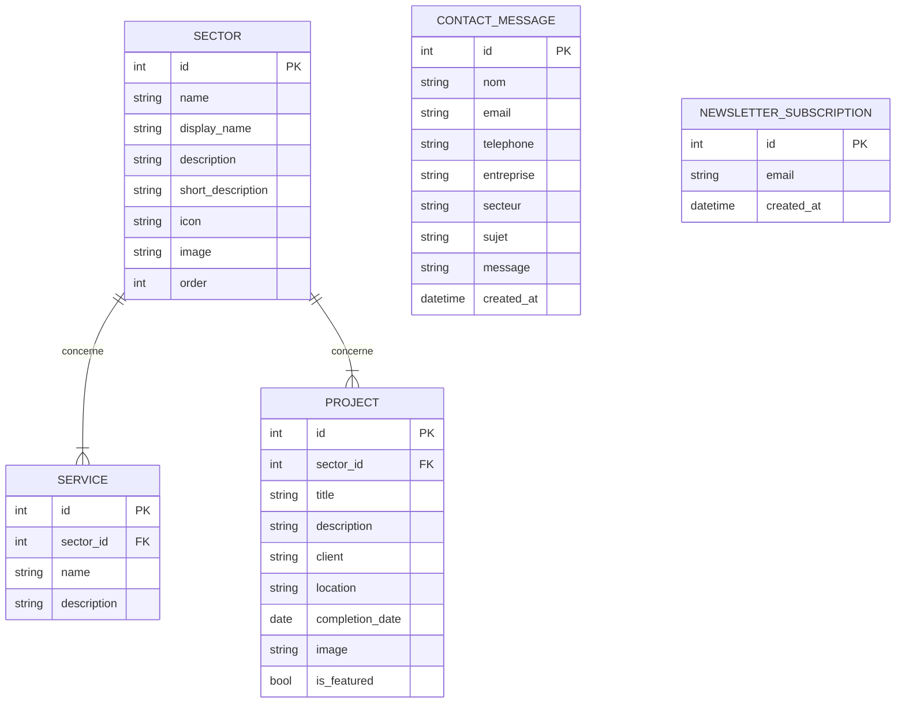
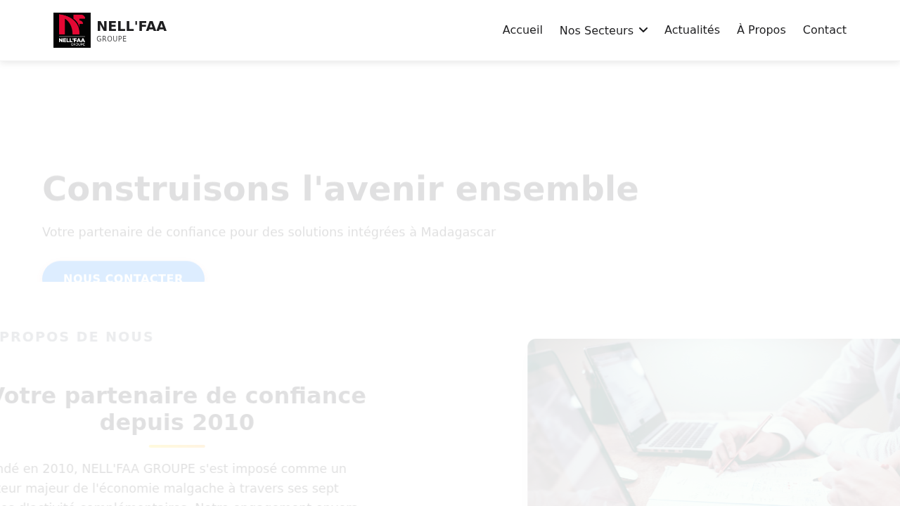

# UNIVERSITE DE FIANARANTSOA
## ECOLE NATIONALE D’INFORMATIQUE
…………………………………
# RAPPORT DE PROJET DE FIN D’ANNEE EN PREMIERE ANNEE DE LICENCE PROFESSIONNELLE
…………………………………
## MENTION: INFORMATIQUE
### PARCOURS GENIE LOGICIEL ET BASE DE DONNEES
………….……….…………….


**Présenté par :**
-	Monsieur nom et prénoms, matricule
-	Monsieur nom et prénoms, matricule
-	Mademoiselle nom et prénoms, matricule
-	Mademoiselle nom et prénoms, matricule

**Sous l’encadrement de :**
Monsieur Nom et prénoms, grade

**Année universitaire 2023-2024**

# CURRICULUM VITAE

## ETAT CIVIL
- **Nom**: [Votre Nom]
- **Prénoms**: [Vos Prénoms]
- **Date et lieu de naissance**: [Votre date et lieu de naissance]
- **Adresse**: [Votre adresse]
- **Téléphone**: [Votre numéro de téléphone]
- **Email**: [Votre adresse e-mail]

## FORMATION
- **2023-2024**: Première année de Licence Professionnelle en Génie Logiciel et Base de Données, Ecole Nationale d'Informatique, Université de Fianarantsoa.
- **2022-2023**: Année préparatoire aux études d'ingénieur, Ecole Nationale d'Informatique, Université de Fianarantsoa.
- **2022**: Baccalauréat série C, [Votre lycée].

## COMPETENCES TECHNIQUES
- **Langages de programmation**: PHP, Python, Java, C, JavaScript, HTML, CSS.
- **Bases de données**: SQLite, MySQL, PostgreSQL.
- **Frameworks et bibliothèques**: React, Django, Node.js.
- **Outils**: Git, Docker, Visual Studio Code.

## COMPETENCES LINGUISTIQUES
- **Malgache**: Langue maternelle
- **Français**: Courant
- **Anglais**: Technique

## CENTRES D'INTERET
- Informatique, nouvelles technologies, lecture, sport.

# REMERCIEMENTS

La réalisation de ce projet n'aurait pas été possible sans le soutien de plusieurs personnes à qui nous tenons à exprimer notre profonde gratitude.

Nous remercions tout d'abord notre encadreur, Monsieur [Nom de l'encadreur], pour sa disponibilité, ses conseils avisés et son soutien constant tout au long de ce projet.

Nous tenons également à remercier l'ensemble du corps professoral de l'Ecole Nationale d'Informatique de Fianarantsoa pour la qualité de la formation dispensée.

Enfin, nous remercions nos familles et nos amis pour leur soutien moral et leur patience.

# LISTE DES FIGURES

- Figure 1: Modèle Conceptuel de Données (MCD)
- Figure 2: Page d'accueil de l'application

# LISTE DES TABLEAUX

- Tableau 1: Dictionnaire de données de la table `sectors`
- Tableau 2: Dictionnaire de données de la table `services`
- Tableau 3: Dictionnaire de données de la table `projects`
- Tableau 4: Dictionnaire de données de la table `contact_messages`
- Tableau 5: Dictionnaire de données de la table `newsletter_subscriptions`

# LISTE DES ABREVIATIONS

- **API**: Application Programming Interface
- **CSS**: Cascading Style Sheets
- **DAO**: Data Access Object
- **DB**: Database
- **HTML**: HyperText Markup Language
- **HTTP**: HyperText Transfer Protocol
- **JS**: JavaScript
- **MCD**: Modèle Conceptuel de Données
- **MVC**: Modèle-Vue-Contrôleur
- **PHP**: Hypertext Preprocessor
- **SQL**: Structured Query Language

# SOMMAIRE
- [CURRICULUM VITAE](#curriculum-vitae)
- [REMERCIEMENTS](#remerciements)
- [LISTE DES FIGURES](#liste-des-figures)
- [LISTE DES TABLEAUX](#liste-des-tableaux)
- [LISTE DES ABREVIATIONS](#liste-des-abreviations)
- [SOMMAIRE](#sommaire)
- [INTRODUCTION GENERALE](#introduction-generale)
- [PARTIE I: PRESENTATION ET ANALYSE PREALABLE](#partie-i-presentation-et-analyse-prealable)
  - [Chapitre 1 DESCRIPTION DU SUJET](#chapitre-1-description-du-sujet)
    - [1.1 Formulation](#11-formulation)
    - [1.2 Objectif et besoins utilisateur](#12-objectif-et-besoins-utilisateur)
    - [1.3 Résultats attendus](#13-résultats-attendus)
    - [1.4 Moyens nécessaires](#14-moyens-nécessaires)
  - [Chapitre 2 ANALYSE PREALABLE](#chapitre-2-analyse-prealable)
    - [2.1 Analyse de l’existant](#21-analyse-de-lexistant)
    - [2.2 Critique de l’existant](#22-critique-de-lexistant)
    - [2.3 Proposition de solution](#23-proposition-de-solution)
    - [2.4 Solution retenue](#24-solution-retenue)
- [PARTIE II : CONCEPTION ET REALISATION](#partie-ii--conception-et-realisation)
  - [Chapitre 3 CONCEPTION AVANT PROJET](#chapitre-3-conception-avant-projet)
    - [3.1 Système d’exploitation](#31-système-dexploitation)
    - [3.2 Langage de programmation](#32-langage-de-programmation)
    - [3.3 Environnement de développement](#33-environnement-de-développement)
  - [Chapitre 4 CONCEPTION DE LA BASE DE DONNEES](#chapitre-4-conception-de-la-base-de-donnees)
    - [4.1 Dictionnaire de Données](#41-dictionnaire-de-données)
    - [4.2 Règle de gestion](#42-règle-de-gestion)
    - [4.3 Modèle conceptuelle de données (MCD)](#43-modèle-conceptuelle-de-données-mcd)
    - [4.4 Schéma relationnelle](#44-schéma-relationnelle)
  - [Chapitre 5 REALISATION](#chapitre-5-realisation)
    - [5.1 Description de la base de données](#51-description-de-la-base-de-données)
    - [5.2 Elaboration des algorithmes](#52-elaboration-des-algorithmes)
    - [5.3 Présentation de l’application (Captures d’écran)](#53-présentation-de-lapplication-captures-décran)
- [CONCLUSION](#conclusion)
- [WEBOGRAPHIE](#webographie)
- [GLOSSAIRE](#glossaire)

# INTRODUCTION GENERALE

Dans un monde de plus en plus numérique, la présence en ligne est devenue un facteur crucial pour le succès et la croissance des entreprises. Un site web professionnel et bien conçu est non seulement une vitrine pour les produits et services, mais aussi un outil de communication essentiel pour interagir avec les clients et les partenaires. C'est dans ce contexte que s'inscrit ce projet de fin d'année, qui porte sur la refonte du site web de l'entreprise Nell'Faa Groupe Majunga.

Ce rapport détaille les différentes étapes du projet, de l'analyse de l'existant à la réalisation de la nouvelle plateforme. La première partie présente le sujet, les objectifs et les besoins des utilisateurs, ainsi qu'une analyse critique de l'ancienne solution. La deuxième partie se concentre sur la conception et la réalisation du nouveau site, en abordant les aspects techniques tels que l'architecture, la base de données et les algorithmes mis en œuvre.

# PARTIE I: PRESENTATION ET ANALYSE PREALABLE

## Chapitre 1 DESCRIPTION DU SUJET

### 1.1 Formulation

Le projet consiste en la refonte du site web de l'entreprise "Nell'Faa Groupe Majunga", un conglomérat diversifié opérant dans sept secteurs d'activité distincts à Madagascar. L'objectif est de moderniser la présence en ligne de l'entreprise en remplaçant l'ancienne plateforme, basée sur une architecture complexe React/Django, par une solution plus monolithique et plus simple à maintenir, développée en PHP.

### 1.2 Objectif et besoins utilisateur

L'objectif principal est de créer un site web professionnel, responsive et moderne qui reflète l'image de marque de Nell'Faa Groupe Majunga. Le site doit présenter de manière claire et concise les différents secteurs d'activité, les services offerts, ainsi que les projets réalisés par l'entreprise.

Les besoins utilisateurs sont les suivants :
- **Visiteurs**: Accéder facilement aux informations sur l'entreprise, ses secteurs d'activité et ses services.
- **Administrateurs**: Gérer le contenu du site (secteurs, services, projets) de manière simple et intuitive.

### 1.3 Résultats attendus

Le projet doit aboutir à un site web entièrement fonctionnel, présentant les caractéristiques suivantes :
- Un design responsive, assurant une expérience utilisateur optimale sur tous les appareils (ordinateurs, tablettes, smartphones).
- Une navigation intuitive, permettant aux visiteurs de trouver rapidement les informations recherchées.
- Des pages dédiées à chaque secteur d'activité, avec des descriptions détaillées des services et des projets.
- Un formulaire de contact fonctionnel pour les demandes de renseignements et de devis.

### 1.4 Moyens nécessaires

#### Moyens matériels:
- Un ordinateur portable ou de bureau avec un accès à Internet.
- Un serveur d'hébergement web compatible avec PHP et SQLite.

#### Moyens logiciels:
- Un éditeur de code (par exemple, Visual Studio Code).
- Un serveur web local (par exemple, Apache ou le serveur intégré de PHP).
- Un système de gestion de base de données (SQLite).
- Un navigateur web pour les tests (par exemple, Google Chrome, Mozilla Firefox).

## Chapitre 2 ANALYSE PREALABLE

### 2.1 Analyse de l’existant

L'ancien site web de Nell'Faa Groupe Majunga était basé sur une architecture microservices avec un frontend développé en React.js et un backend en Django (Python). Cette architecture, bien que puissante, présentait une complexité de développement et de maintenance élevée, inadaptée aux besoins de l'entreprise.

### 2.2 Critique de l’existant

#### Points forts:
- **Scalabilité**: L'architecture microservices permettait une grande scalabilité.
- **Flexibilité**: Le découplage entre le frontend et le backend offrait une grande flexibilité.

#### Points faibles:
- **Complexité**: La gestion de deux projets distincts (frontend et backend) augmentait la complexité du développement et du déploiement.
- **Coûts de maintenance**: La maintenance de deux environnements différents (Node.js pour React et Python pour Django) entraînait des coûts plus élevés.
- **Difficulté de recrutement**: Trouver des développeurs compétents dans les deux technologies était un défi.

### 2.3 Proposition de solution

Face aux inconvénients de l'ancienne solution, une refonte complète du site a été proposée, en optant pour une architecture monolithique basée sur PHP. Cette approche vise à simplifier le développement, le déploiement et la maintenance, tout en répondant aux besoins fonctionnels du site.

### 2.4 Solution retenue

La solution retenue est le développement d'un site web en PHP natif, sans l'utilisation de frameworks complexes. Cette approche offre les avantages suivants :
- **Simplicité**: Un code plus simple et plus facile à comprendre pour les développeurs.
- **Maintenance facilitée**: Une seule base de code à maintenir.
- **Déploiement simplifié**: Un déploiement plus rapide et moins complexe sur des serveurs d'hébergement mutualisés.
- **Performance**: Des temps de chargement optimisés grâce à une architecture plus légère.

# PARTIE II : CONCEPTION ET REALISATION

## Chapitre 3 CONCEPTION AVANT PROJET

### 3.1 Système d’exploitation

Le développement du projet a été réalisé sur un environnement de développement standard, compatible avec les systèmes d'exploitation les plus courants (Windows, macOS, Linux). Le serveur de production est basé sur une distribution Linux, offrant une stabilité et une sécurité optimales pour l'hébergement d'applications web.

### 3.2 Langage de programmation

La refonte du site a été réalisée en utilisant les langages de programmation web suivants :
- **PHP**: Pour la logique serveur, la gestion des requêtes et l'interaction avec la base de données.
- **HTML**: Pour la structure des pages web.
- **CSS**: Pour la mise en forme et le design du site.
- **JavaScript**: Pour les fonctionnalités interactives côté client.
- **SQL**: Pour la définition et la manipulation des données dans la base de données SQLite.

### 3.3 Environnement de développement

L'environnement de développement comprenait les outils suivants :
- **Visual Studio Code**: Un éditeur de code léger et puissant, avec de nombreuses extensions pour le développement web.
- **Serveur web intégré de PHP**: Pour le développement et les tests en local.
- **SQLite**: Un système de gestion de base de données léger et facile à utiliser, idéal pour le développement et les applications à faible trafic.
- **Google Chrome / Mozilla Firefox**: Pour le débogage et le test de la compatibilité du site sur différents navigateurs.

## Chapitre 4 CONCEPTION DE LA BASE DE DONNEES

### 4.1 Dictionnaire de Données

#### Table `sectors`
| Nom du champ      | Type        | Description                               |
| ----------------- | ----------- | ----------------------------------------- |
| id                | INTEGER     | Identifiant unique du secteur (clé primaire) |
| name              | TEXT        | Nom interne du secteur (ex: "btp")        |
| display_name      | TEXT        | Nom d'affichage du secteur (ex: "BTP")     |
| description       | TEXT        | Description complète du secteur           |
| short_description | TEXT        | Description courte pour les aperçus       |
| icon              | TEXT        | Icône représentant le secteur             |
| image             | TEXT        | Image d'illustration du secteur           |
| order             | INTEGER     | Ordre d'affichage du secteur              |

#### Table `services`
| Nom du champ      | Type    | Description                               |
| ----------------- | ------- | ----------------------------------------- |
| id                | INTEGER | Identifiant unique du service (clé primaire) |
| sector_id         | INTEGER | Clé étrangère vers la table `sectors`     |
| name              | TEXT    | Nom du service                            |
| description       | TEXT    | Description du service                    |

#### Table `projects`
| Nom du champ      | Type    | Description                               |
| ----------------- | ------- | ----------------------------------------- |
| id                | INTEGER | Identifiant unique du projet (clé primaire) |
| sector_id         | INTEGER | Clé étrangère vers la table `sectors`     |
| title             | TEXT    | Titre du projet                           |
| description       | TEXT    | Description du projet                     |
| client            | TEXT    | Nom du client                             |
| location          | TEXT    | Emplacement du projet                     |
| completion_date   | DATE    | Date d'achèvement du projet               |
| image             | TEXT    | Image du projet                           |
| is_featured       | BOOLEAN | Indique si le projet est mis en avant     |

#### Table `contact_messages`
| Nom du champ      | Type     | Description                               |
| ----------------- | -------- | ----------------------------------------- |
| id                | INTEGER  | Identifiant unique du message (clé primaire)|
| nom               | TEXT     | Nom de l'expéditeur                       |
| email             | TEXT     | Adresse e-mail de l'expéditeur            |
| telephone         | TEXT     | Numéro de téléphone de l'expéditeur       |
| entreprise        | TEXT     | Nom de l'entreprise de l'expéditeur       |
| secteur           | TEXT     | Secteur concerné par le message           |
| sujet             | TEXT     | Sujet du message                          |
| message           | TEXT     | Contenu du message                        |
| created_at        | DATETIME | Date et heure de création du message      |

#### Table `newsletter_subscriptions`
| Nom du champ      | Type     | Description                               |
| ----------------- | -------- | ----------------------------------------- |
| id                | INTEGER  | Identifiant unique de l'abonnement (clé primaire) |
| email             | TEXT     | Adresse e-mail de l'abonné                |
| created_at        | DATETIME | Date et heure de l'abonnement             |

### 4.2 Règle de gestion

- **RG1**: Un service doit obligatoirement être associé à un secteur.
- **RG2**: Un projet doit obligatoirement être associé à un secteur.
- **RG3**: Un message de contact doit contenir au minimum un nom, une adresse e-mail et un message.
- **RG4**: L'adresse e-mail d'un abonné à la newsletter doit être unique.
- **RG5**: Le champ `order` de la table `sectors` doit être un entier positif unique, utilisé pour déterminer l'ordre d'affichage des secteurs.
- **RG6**: Le champ `is_featured` de la table `projects` est un booléen qui détermine si un projet doit être affiché sur la page d'accueil.

### 4.3 Modèle conceptuelle de données (MCD)


*Figure 1: Modèle Conceptuel de Données (MCD)*

### 4.4 Schéma relationnelle

- **sectors** (<u>id</u>, name, display_name, description, short_description, icon, image, order)
- **services** (<u>id</u>, #sector_id, name, description)
- **projects** (<u>id</u>, #sector_id, title, description, client, location, completion_date, image, is_featured)
- **contact_messages** (<u>id</u>, nom, email, telephone, entreprise, secteur, sujet, message, created_at)
- **newsletter_subscriptions** (<u>id</u>, email, created_at)

## Chapitre 5 REALISATION

### 5.1 Description de la base de données

La base de données SQLite est constituée de cinq tables, conçues pour stocker toutes les informations nécessaires au bon fonctionnement du site web. La table `sectors` contient les informations sur les sept secteurs d'activité de l'entreprise. Les tables `services` et `projects` sont liées à la table `sectors` par une clé étrangère, ce qui permet d'associer chaque service and chaque projet à un secteur spécifique. Les tables `contact_messages` et `newsletter_subscriptions` sont utilisées pour stocker les données soumises par les utilisateurs via les formulaires du site.

### 5.2 Elaboration des algorithmes

L'application PHP suit une architecture simple et procédurale. La logique principale est la suivante :
1.  **Initialisation**: Le fichier `config.php` établit la connexion à la base de données SQLite.
2.  **Routing**: Le fichier `index.php` agit comme un routeur de base, incluant les fichiers de page appropriés en fonction de l'URL.
3.  **Inclusion de templates**: Les fichiers `includes/header.php` et `includes/footer.php` sont inclus sur chaque page pour assurer une présentation cohérente.
4.  **Récupération de données**: Les pages PHP interrogent la base de données pour récupérer les informations nécessaires (par exemple, la liste des secteurs sur la page d'accueil).
5.  **Affichage**: Les données sont ensuite affichées dans le code HTML, en utilisant des boucles `foreach` pour parcourir les résultats de la base de données.

#### Exemple de code : Récupération des secteurs

```php
// Fichier: index.php

// Inclure la configuration de la base de données
require_once 'config.php';

// Fonction pour récupérer tous les secteurs
function get_all_sectors($db) {
    $stmt = $db->prepare('SELECT * FROM sectors ORDER BY "order" ASC');
    $result = $stmt->execute();
    $sectors = [];
    while ($row = $result->fetchArray(SQLITE3_ASSOC)) {
        $sectors[] = $row;
    }
    return $sectors;
}

$sectors = get_all_sectors($db);
```

Ce code illustre comment les données sont récupérées de la base de données. La fonction `get_all_sectors` prend en paramètre l'objet de connexion à la base de données, prépare une requête SQL pour sélectionner tous les secteurs, exécute la requête, et retourne un tableau contenant les résultats.

### 5.3 Présentation de l’application (Captures d’écran)

Voici une capture d'écran de la page d'accueil de l'application :


*Figure 2: Page d'accueil de l'application*

# CONCLUSION

Ce projet de refonte du site web de Nell'Faa Groupe Majunga a été une expérience enrichissante, qui a permis de mettre en pratique les connaissances acquises en génie logiciel et en développement web. Le passage d'une architecture complexe React/Django à une solution plus simple en PHP a permis de répondre aux besoins de l'entreprise en termes de simplicité, de maintenabilité et de performance.

Le nouveau site offre une expérience utilisateur améliorée, avec un design moderne, une navigation intuitive et un contenu clair et accessible. La base de données SQLite, légère et facile à gérer, s'est avérée être un choix judicieux pour ce projet.

Ce projet a également été l'occasion de développer des compétences en gestion de projet, en travaillant en équipe pour atteindre les objectifs fixés dans les délais impartis.

# WEBOGRAPHIE

- [PHP](https://www.php.net/)
- [SQLite](https://www.sqlite.org/index.html)
- [Visual Studio Code](https://code.visualstudio.com/)
- [Playwright](https://playwright.dev/)
- [Mermaid](https://mermaid-js.github.io/mermaid/#/)

# GLOSSAIRE

- **API**: Application Programming Interface (Interface de Programmation d'Application)
- **CSS**: Cascading Style Sheets (Feuilles de Style en Cascade)
- **DAO**: Data Access Object
- **DB**: Database
- **HTML**: HyperText Markup Language (Langage de Balisage d'Hypertexte)
- **HTTP**: HyperText Transfer Protocol
- **JS**: JavaScript
- **MCD**: Modèle Conceptuel de Données
- **MVC**: Modèle-Vue-Contrôleur
- **PHP**: Hypertext Preprocessor, un langage de programmation principalement utilisé pour produire des pages Web dynamiques.
- **React**: Une bibliothèque JavaScript pour construire des interfaces utilisateur.
- **SQL**: Structured Query Language (Langage de Requête Structuré)

# RESUME

Ce rapport présente la refonte du site web de Nell'Faa Groupe Majunga. Le projet a consisté à remplacer une architecture React/Django par une solution PHP monolithique, plus simple et plus performante. Le rapport détaille les étapes du projet, de l'analyse à la réalisation, en passant par la conception de la base de données.

# ABSTRACT

This report presents the redesign of the Nell'Faa Groupe Majunga website. The project consisted of replacing a React/Django architecture with a simpler, more efficient monolithic PHP solution. The report details the project stages, from analysis to implementation, including the database design.
